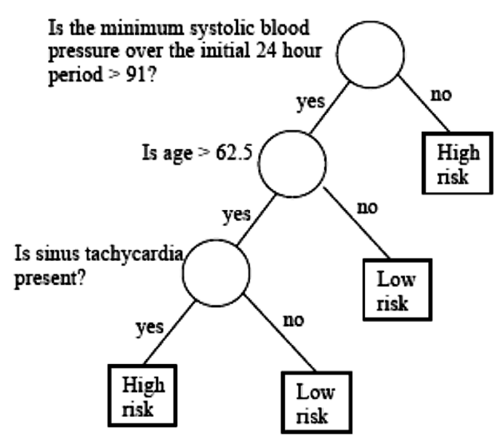
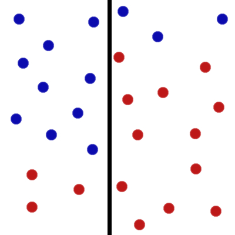
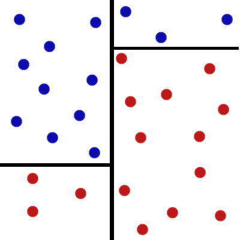
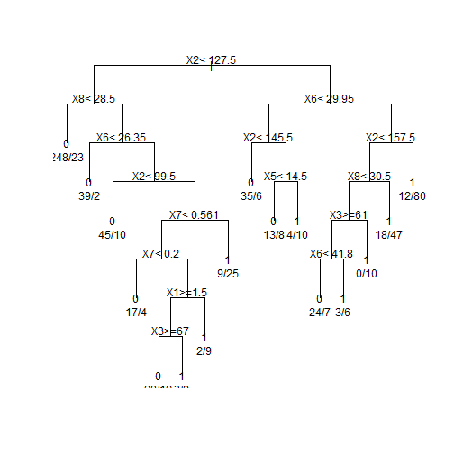
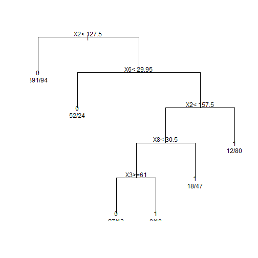
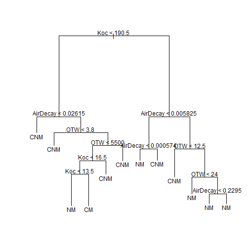
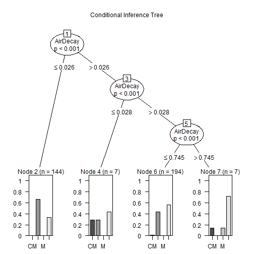
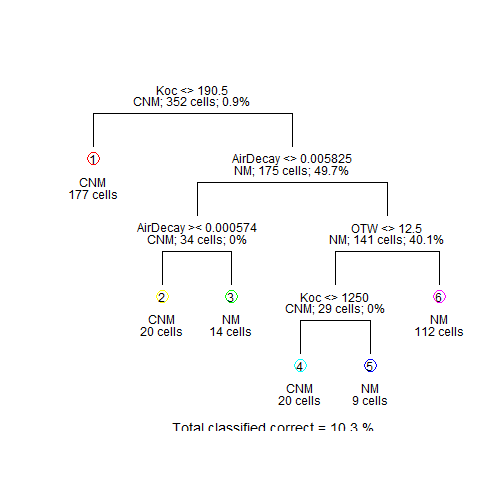
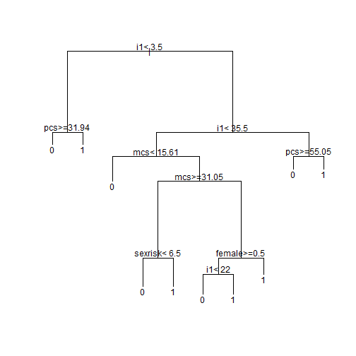
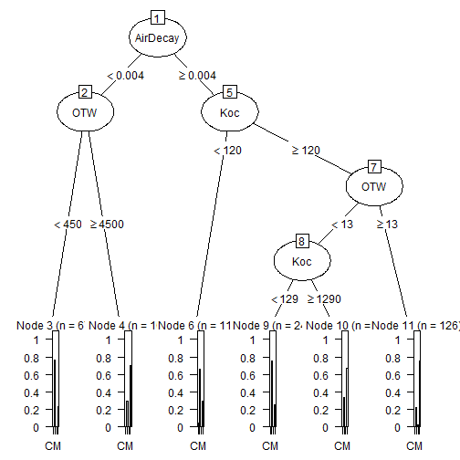

<style>
body {
  background-image: url(41335688-beautiful-tree.jpg);
  background-position: center center;
  background-attachment: fixed;
  background-repeat: no-repeat;
  background-size: 100% 100%;
  padding:0;
  margin:0;
}

.section .reveal .state-background {
    background-image: url(41335688-beautiful-tree.jpg);
    background-position: center center;
    background-attachment: fixed;
    background-repeat: no-repeat;
    background-size: 100% 100%;
    padding:0;
    margin:0;
}

.reveal {
    color: white;
    text-shadow: 0 0 30px #000000, 0 0 40px #004d00;
}

.reveal h1 {
    color: white;
    text-shadow: 0 0 30px #000000, 0 0 40px #004d00;
}

.reveal h2 {
    color: white;
    text-shadow: 0 0 30px #000000, 0 0 40px #004d00;
}

.reveal h3 {
    color: white;
    text-shadow: 0 0 30px #003300, 0 0 40px #004d00;
}

.reveal h4 {
    color: white;
    text-shadow: 0 0 30px #000000, 0 0 40px #004d00;
}

.reveal p {
  color: white;
  text-shadow: 0 0 30px #000000, 0 0 40px #004d00;
}

.small-code pre code {
  font-size: 1em;
  text-shadow: 0 0 0px #000000, 0 0 0px #004d00;
}

.reveal section del {
  color: #ff9900;
}

.reveal h1, .reveal h2, .reveal h3 {
  word-wrap: normal;
  -moz-hyphens: none;
}

.footer {
    color: black; 
    background: #E8E8E8;
    position: fixed; 
    top: 100%;
    text-align: left; 
    width: 100%;
    opacity : 0.55;
    font-size: 10%;
}

.midcenter {
    position: fixed;
    top: 50%;
    left: 50%;
}

.reveal h1, .reveal h2, .reveal h3 {
  word-wrap: normal;
  -moz-hyphens: none;
}

div.transbox {
    background-color: rgba(0,77,0,0.4);
    padding-top: 20px;
    padding-right: 20px;
    padding-bottom: 20px;
    padding-left: 20px;
}

div.transbox p {
    font-weight: bold;
    color: rgba(255,255,255);
}
</style>


How to use tree based classification in R
========================================================
font-family: 'Georgia'

<div class="transbox">The goal: give some brief examples on a few approaches on growing trees and, in particular, the overview of R packages used for those purposes.</div><br>
<div class="transbox"><small>Disclaimer: all examples are based on the data from public webstorages or on the data shipped with the R packages.</small><br>
<small>Enveronnement and technologies: RStudio, Authoring R Presentations, R, Markdown, CSS, HTML5.</small><br></div>

<div class="footer"">Kate Makhnach, November 14, 2016</div>


Summary
========================================================
<div class="footer">Kate Makhnach, November 14, 2016</div>
<div class="transbox"><ul>
<li>Introduction</li>
<li>Notation and elements</li>
<li>Settings</li>
<li>Variable combinations and missing values</li>
<li>Pruning</li>
<li>Advantages</li>
</ul></div>
***
<div class="transbox"><ul>
<li>rpart </li>
<li>tree</li>
<li>party</li>
<li>maptree</li>
<li>partykit</li>
<li>evtree</li>
</ul></div>


Introduction
========================================================
<div class="footer">Kate Makhnach, November 14, 2016</div>
<div class="transbox"><small><ul>
<li>can be used for both regression and classification problems</li>
<li>very different approach to classification than prototype methods</li>
<li>no centroids, no hyperplanes boundaries</li>
<li>show the probability of being in any hierarchical group</li>
<li>basic idea of decision trees and three elements</li>
<li>wide array of packages in R and packages combining</li>
</ul></small></div>


A medical example
================================
<div class="footer">Kate Makhnach, November 14, 2016</div>




Notations
===============================
<div class="footer">Kate Makhnach, November 14, 2016</div>
<div class="transbox"><ul>
<li>We will denote the feature space by $X$. Normally $X$ is a multidimensional Euclidean space.</li>
<li>The input vector is indicated by $X \epsilon X$ contains p features $X_1$, $X_2$, ... ,$X_p$.</li>
<li>A node is denoted by $t$. We will also denote the left child node by $t_L$ and the right one by $t_R$ .</li>
<li>Denote the collection of all the nodes in the tree by $T$ and the collection of all the leaf nodes by $\hat T$.</li>
<li>A split will be denoted by $s$. The set of splits is denoted by $S$.</li>
</ul></div>


Three elements
===============================
<div class="footer">Kate Makhnach, November 14, 2016</div>
<figure>
  <object width="700" height="500" data="https://onlinecourses.science.psu.edu//stat857/sites/onlinecourses.science.psu.edu.stat857/files/lesson13/defining_nodes.swf"></object>
  <figcaption>.</figcaption>
</figure>


How these splits can take place.
================================
<div class="footer">Kate Makhnach, November 14, 2016</div>
<figure>
  <object width="700" height="500" data="https://onlinecourses.science.psu.edu/stat857/sites/onlinecourses.science.psu.edu.stat857/files/lesson13/splits_viewlet_swf.html"></object>
  <figcaption></figcaption>
</figure>


Settings
====================
<div class="footer">Kate Makhnach, November 14, 2016</div>
<div class="transbox"><ul>
<li>a set $Q$ of binary questions $$\{Is  x \epsilon A\}, A \epsilon X$$<li>
<li>goodness of split criterion $\Phi (s,t)$</li>
<li>a stop-splitting rule</li>
<li>a rule for assigning every terminal node to a class</li>
</ul></div>


Standard set of questions for suggesting possible splits
=============================
<div class="footer">Kate Makhnach, November 14, 2016</div>
<div class="transbox"><small>If the input vector contains features of both categorical and ordered types:</small> 
$$X=(X_1, X_2, ... ,X_p)$$
$$X_j - an \_ ordered \_ variable$$
$$c - a \_ realvalued \_ threshold$$
$$\{Is \_ X_j \leqq c?\}$$
<small>If $X_j$ is categorical, say taking values from $\{1, 2, ... , M\}$:</small> $$\{Is \_ X_j \epsilon A?\}$$
where $A$ is any subset of $\{1, 2, ... , M\}$.
</div>


Determining goodness of split
===============================
<div class="footer">Kate Makhnach, November 14, 2016</div>



***




The impurity function
=======================
<div class="footer">Kate Makhnach, November 14, 2016</div>
<div class="transbox"><small>$K$ - the number of classes</br>
$p_1, p_2, ..., p_K$ - the probabilities for any data point in the region belonging to class 1, 2,..., K</br>
<span style="font-weight:bold; color:orange;">An impurity function</span> is a function $\Phi$ defined on the set of all K-tuples of numbers $(p_1, ...,p_K)$ satisfying $p_j \geqq 0$, $j=1, ...,K$, $\sum_jp_j=1$ with the properties:</br></br>
<ol>
<li>$\Phi$ achieves maximum only for the uniform distribution, that is all the $p_j$ are equal.</li>
<li>$\Phi$ achieves minimum only at the points $(1, 0, ... , 0), (0, 1, 0, ... , 0), ..., (0, 0, ... , 0, 1)$.</li>
<li>$\Phi$ is a symmetric function of $p_1, ...,p_K$.</li>
</ol></small></div>


Possible impurity functions:
============================
<div class="footer">Kate Makhnach, November 14, 2016</div>
<div class="transbox">
Entropy function: $$\sum_{j=1}^{K} p_j \log \frac{1}{p_j}$$ 
If $p_j = 0$, use the limit $$\lim p_j \rightarrow \log p_j=0$$
 
Misclassification rate: $$1- \max jp_j$$
 
Gini index: $$\sum_{j=1}^{K} p_j(1-p_j)=1- \sum_{j=1}^{K} p_j^2$$
</div>


The Twoing rule
============================
<div class="footer">Kate Makhnach, November 14, 2016</div>
<div class="transbox"><small>Another splitting method is the Twoing Rule. The intuition here is that the class distributions in the two child nodes should be as different as possible and the proportion of data falling into either of the child nodes should be balanced. At node $t$, choose the split $s$ that maximizes:

$$\frac{p_Lp_R}{4}  \left[ \sum_{j} |p(j|t_L)-p(j|t_R)|\right]^2$$

When we break one node to two child nodes, we want the posterior probabilities of the classes to be as different as possible. If they differ a lot, each tends to be pure. If instead the proportions of classes in the two child nodes are roughly the same as the parent node, this indicates the splitting does not make the two child nodes much purer than the parent node and hence not a successful split.
</small></div>


Determining stopping criteria
==========================
<div class="footer">Kate Makhnach, November 14, 2016</div>
<div class="transbox">$$\max_{s \epsilon S} \Delta I(s,t) < \beta$$</div>
<figure>
  <object width="700" height="500" data="https://onlinecourses.science.psu.edu/stat857/sites/onlinecourses.science.psu.edu.stat857/files/lesson13/checkboard_viewlet_swf.html"></object>
  <figcaption></figcaption>
</figure>


Determining class assignment rules
==============================
<div class="footer">Kate Makhnach, November 14, 2016</div>
<div class="transbox"><small>A class assignment rule assigns a class $j=1, ...,K$ to every terminal (leaf) node $t \epsilon \hat T$. The class is assigned to node $t$. $\hat T$ is denoted by ??(t), e.g., if ??(t)=2, all the points in node t would be assigned to class 2.</br></br>

For example if we use 0-1 loss, the class assignment rule is very similar to k-means (where we pick the majority class or the class with the maximum posterior probability):

$$??(t)= \arg  \max_j p(j|t)$$
</small></div>


Variable combinations
==========================
<div class="footer">Kate Makhnach, November 14, 2016</div>
<div class="transbox">How to avoid the restriction of only partitions the space by hyperplanes parallel to the coordinate planes?</br></br>
<ul>
<li>There are classification tree extensions which, instead of thresholding individual variables, perform LDA for every node.</li>

<li>We could use more complicated questions. For example, use linear combinations of variables: $$\sum a_jx_j \leq c?$$</li>
</ul>
</div>


Missing values
==========================
<div class="footer">Kate Makhnach, November 14, 2016</div>
<div class="transbox"><ul>
<li>surrogate or replacement split</li>
<li>approximate the result of the best split</li>
<li>no guarantee the second best split divides data similarly</li>
<li>goodness measurements are close</li>
</ul>
</div>


Notion of Pruning 
===============================
<div class="footer">Kate Makhnach, November 14, 2016</div>
<div class="transbox"><small>remove nodes that do not provide additional information</small></div>
<figure>
  <object width="700" height="500" data="https://onlinecourses.science.psu.edu/stat857/sites/onlinecourses.science.psu.edu.stat857/files/lesson13/tree_parts_viewlet_swf.html"></object>
  <figcaption></figcaption>
</figure>


Pruning example
===============================
<div class="footer">Kate Makhnach, November 14, 2016</div>
<div class="transbox"><small>remove nodes that do not provide additional information</small></div>
<figure>
  <object width="700" height="500" data="https://onlinecourses.science.psu.edu/stat857/sites/onlinecourses.science.psu.edu.stat857/files/lesson13/pruning_viewlet_swf.html"></object>
  <figcaption></figcaption>
</figure>


Advantages of tree-structured classification methods.
================================== 
<div class="footer">Kate Makhnach, November 14, 2016</div>
<div class="transbox"><ul>
<li>handles both categorical and ordered variables in a simple and natural way</li>
<li>sometimes do an automatic stepwise variable selection and complexity reduction</li>
<li>provide an estimate of the misclassification rate for a test point</li>
<li>invariant under all monotone transformations of individual ordered variables</li>
<li>relatively robust to outliers and misclassified points in the training set</li>
<li>easy to interpret</li>
</div>


Package "rpart"
======================================
class: small-code
<div class="footer">Kate Makhnach, November 14, 2016</div>

```r
# set the working directory
# comma delimited data and no header for each variable
RawData <- read.table("http://archive.ics.uci.edu/ml/machine-learning-databases/pima-indians-diabetes/pima-indians-diabetes.data",sep = ",",header=FALSE)
responseY <- as.matrix(RawData[,dim(RawData)[2]])
predictorX <- as.matrix(RawData[,1:(dim(RawData)[2]-1)])
data.train <- as.data.frame(cbind(responseY, predictorX))
names(data.train) <- c("Y", "X1", "X2", "X3", "X4", "X5", "X6", "X7", "X8")
library(rpart)
set.seed(19)
model.tree <- rpart(Y ~ X1 + X2 + X3 + X4 + X5 + X6 + X7 + X8, data.train, method="class")
plot(model.tree, uniform=T)
text(model.tree, use.n=T)
```


Classification tree obtained by the tree growing function
======================================
class: small-code
<div class="footer">Kate Makhnach, November 14, 2016</div>



Pruning the tree
======================================
class: small-code
<div class="footer">Kate Makhnach, November 14, 2016</div>

```r
# "CP" - the complexity parameter
# the number of split - "nsplit"
# "xerror" - cross-validated classification error rates
# the standard deviation of the cross-validation error rates  - "xstd"
# !!!select a tree size that minimizes the cross-validated error ("xerror")
model.tree$cptable
```

```
          CP nsplit rel error    xerror       xstd
1 0.24253731      0 1.0000000 1.0000000 0.04928752
2 0.10447761      1 0.7574627 0.7985075 0.04636031
3 0.01741294      2 0.6529851 0.7425373 0.04530720
4 0.01492537      5 0.6007463 0.7126866 0.04469811
5 0.01305970      9 0.5410448 0.7126866 0.04469811
6 0.01119403     12 0.4925373 0.7313433 0.04508278
7 0.01000000     15 0.4589552 0.7313433 0.04508278
```


```r
opt <- model.tree$cptable[which.min(model.tree$cptable[,"xerror"]),"CP"]
model.ptree <- prune(model.tree, cp = opt)
plot(model.ptree, uniform=T)
text(model.ptree, use.n=T)
```


The optimized tree
======================================
class: small-code
<div class="footer">Kate Makhnach, November 14, 2016</div>



Package "tree"
==============================
class: small-code
<div class="footer">Kate Makhnach, November 14, 2016</div>


```r
library(tree)
tr = tree(frmla, data=raw)
#summary(tr)
plot(tr); text(tr)
```




Package "party"
=============================================
class: small-code
<div class="footer">Kate Makhnach, November 14, 2016</div>


```r
library(party)
ct = ctree(frmla, data = raw)
plot(ct, main="Conditional Inference Tree")
```



```r
#Table of prediction errors
table(predict(ct), raw$Metal)
```

```
     
       CM CNM   M  NM
  CM    0   0   0   0
  CNM   0  95   1  48
  M     0   0   0   0
  NM    5  85   2 116
```

```r
# Estimated class probabilities
tr.pred = predict(ct, newdata=raw, type="prob")
```


Table of prediction errors
=============================================
class: small-code
<div class="footer">Kate Makhnach, November 14, 2016</div>


```r
#Table of prediction errors
table(predict(ct), raw$Metal)
```

```
     
       CM CNM   M  NM
  CM    0   0   0   0
  CNM   0  95   1  48
  M     0   0   0   0
  NM    5  85   2 116
```

```r
# Estimated class probabilities
tr.pred = predict(ct, newdata=raw, type="prob")
```


Package "maptree"
===========================================
class: small-code
<div class="footer">Kate Makhnach, November 14, 2016</div>


```r
library(maptree)
library(cluster)
draw.tree( clip.rpart (rpart ( raw), best=7),
nodeinfo=TRUE, units="species",
cases="cells", digits=0)
```




Package "partykit"
=================================================
class: small-code
<div class="footer">Kate Makhnach, November 14, 2016</div>


```r
ds = read.csv("http://www.math.smith.edu/r/data/help.csv")
library(rpart); library(partykit)
ds$sub = as.factor(ds$substance)
homeless.rpart = rpart(homeless ~ female + i1 + sub + sexrisk + mcs +
  pcs, method="class", data=ds)
plot(homeless.rpart)
text(homeless.rpart)
```




Package "partykit"
=================================================
class: small-code
<div class="footer">Kate Makhnach, November 14, 2016</div>


```r
printcp(homeless.rpart)
```

```

Classification tree:
rpart(formula = homeless ~ female + i1 + sub + sexrisk + mcs + 
    pcs, data = ds, method = "class")

Variables actually used in tree construction:
[1] female  i1      mcs     pcs     sexrisk

Root node error: 209/453 = 0.46137

n= 453 

        CP nsplit rel error  xerror     xstd
1 0.095694      0   1.00000 1.00000 0.050766
2 0.049442      1   0.90431 0.98565 0.050709
3 0.033493      4   0.75598 0.92344 0.050358
4 0.021531      5   0.72249 0.91388 0.050289
5 0.014354      7   0.67943 0.87560 0.049970
6 0.010000      9   0.65072 0.85646 0.049786
```


Package "evtree"
=================================================
class: small-code
<div class="footer">Kate Makhnach, November 14, 2016</div>


```r
library(evtree)
ev.raw = evtree(frmla, data=raw)
plot(ev.raw)
```




Package "evtree"
==========================
class: small-code
<div class="footer">Kate Makhnach, November 14, 2016</div>

```r
table(predict(ev.raw), raw$Metal)
```

```
     
       CM CNM   M  NM
  CM    0   0   0   0
  CNM   5 146   0  56
  M     0   0   0   0
  NM    0  34   3 108
```

```r
1-mean(predict(ev.raw) == raw$Metal)
```

```
[1] 0.2784091
```


Combining packages
======================
<div class="footer">Kate Makhnach, November 14, 2016</div>
<div class="transbox"><ul>
<li>repeat each other</li>
<li>graphics or methods</li>
<li>could not working tohehter</li>
<li>the tree package and the rpart package can produce very different results</li>
</ul></div>
